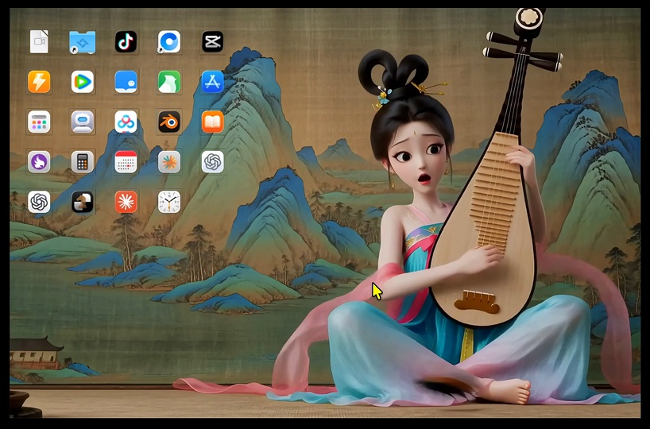
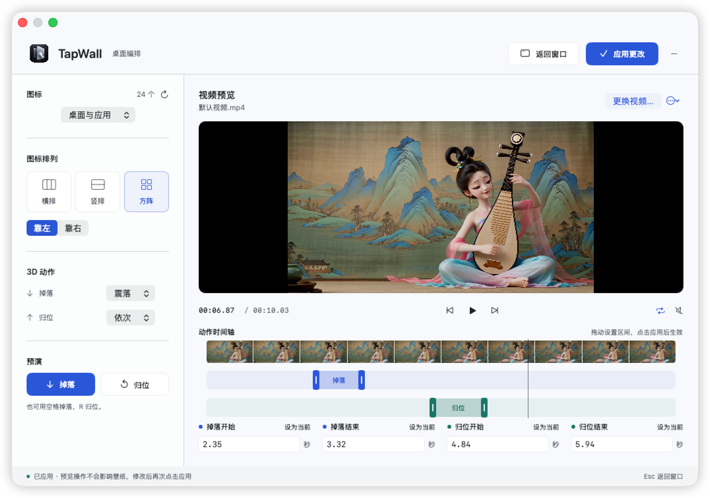

# TapWall

给 Mac 设置视频壁纸，或放一只会回应鼠标的猫咪。

原生 macOS 应用，Swift + SwiftUI + AppKit + SceneKit。无需第三方依赖或联网服务。

- **视频壁纸**：播放本地视频，真实文件图标按指定时间立体掉落、碰撞、归位。
- **互动壁纸**：选择「窗边的猫」，用鼠标逗猫、摸头，或看它打盹。

预览与已应用的桌面独立运行。不移动真实文件、不修改 Finder 布局。

## 案例视频

[](https://xiechengyuan.github.io/TapWall/)

[▶ 在线播放效果演示](https://xiechengyuan.github.io/TapWall/) · [下载视频](https://xiechengyuan.github.io/TapWall/media/demo.mp4)

上方为效果演示视频。应用内置独立的默认壁纸视频，打开即可预览，点击「应用」开始运行。

## 控制台



左侧按「视频壁纸 / 互动壁纸」分类，互动壁纸中再选择场景。上图为旧版视频控制台，展示时间区间的设置方式。

内置视频默认设置：桌面与应用、方阵靠左、震落、依次归位，循环且静音。

| 动作 | 开始 | 结束 |
| --- | --- | --- |
| 掉落 | 2.35 秒 | 3.32 秒 |
| 归位 | 4.84 秒 | 5.94 秒 |

## 运行

需要 macOS 13+ 和 Xcode Command Line Tools：

```sh
xcode-select --install # 已安装可跳过

git clone https://github.com/XieChengYuan/TapWall.git
cd TapWall
bash run.sh
```

首次构建后安装到 `~/Applications/TapWall.app`，之后直接双击打开。无需第三方依赖、API Key 或联网服务。本机临时签名，未做 Apple 公证。

## 使用

### 视频壁纸

先在左侧选择「视频壁纸」。

1. 选择图标来源、横排／竖排／方阵及靠左／靠右。
2. 选择掉落和归位方式，点击按钮预演。
3. 使用内置案例或导入本地视频。蓝色区间设置掉落开始与结束，绿色区间设置归位开始与结束。
4. 拖动区间两端调整时长，拖动色块整体移动；也可输入秒数或设为当前帧。
5. 预览确认后点击「应用」，壁纸从头独立播放。之后修改设置，再点「应用更改」。

**短区间加速、长区间放慢，完整动作不会被截断。** 控制台的播放、暂停、拖动及更换视频只影响预览，不会改变已应用的壁纸。时间区间、动作、排列、循环和声音设置均在点击「应用」时生效。

空格掉落，`R` 归位，`D` 切换桌面模式，`Esc` 返回窗口。快捷键在舞台获得焦点时生效。菜单栏可重新打开控制台，`Cmd+Q` 退出。

桌面或所选文件夹中新建、删除、重命名文件会自动同步到图标层，无需重新应用；已应用的视频和动作设置保持不变。

窗口通过顶部标题栏移动。双击图标打开文件，右键在 Finder 显示；拖动图标可调整位置，视频播放时位置由时间轴控制。

### 互动壁纸

1. 左侧选择「互动壁纸」，在「互动场景」中选择「窗边的猫」。
2. 将鼠标移入预览，体验互动，满意后点击「应用」。
3. 之后暂停预览或切换分类，不会影响桌面；再次点击「应用」才更换壁纸。

猫咪会盯着鼠标、蓄力扑击、伸爪试探。鼠标在窗台下方时，近处直接俯身去够，远处先沿窗台靠近再伸爪；停在头顶会眯眼。闲置后打盹，出现浮动的 Z / ZZ，醒来后消失。

猫咪是本地绘制的二维插画，不需要素材下载。互动模式保留系统桌面图标，鼠标点击穿透到桌面。支持独立暂停预览，并适配系统「减弱动态效果」。

## 开发

```sh
bash build.sh
bash test.sh # 需要已登录的 macOS 图形桌面
```

构建输出可用 `TAPWALL_APP_PATH=/绝对路径/TapWall.app` 指定。默认针对当前 Mac 架构构建；当前已在 Apple Silicon 上验证。

- `Sources/SpatialIcons.swift`：3D 材质、碰撞轨迹与时长映射。
- `Sources/VideoSession.swift`：视频、预览、时间区间。
- `Sources/Console.swift`：控制台与区间编辑。
- `Sources/main.swift`：窗口、图标来源、桌面模式与壁纸应用。
- `Sources/Models.swift`：壁纸分类、场景列表与设置模型。
- `Sources/CatScene.swift`：猫咪绘制、鼠标响应和行为状态。

扩展互动场景时，在 `WallpaperKind` 注册场景并接入预览、应用分支。预览与桌面必须使用独立实例，切换时释放旧场景。

## 当前限制

当前主要面向单屏，互动壁纸仅内置猫咪。视频模式最多显示 32 个图标。修改图标来源、排列、掉落方式或窗口尺寸时，需要短暂重新计算物理轨迹。自选视频和时间区间尚不跨重启保存；每次启动载入内置案例及上述预设。不自动识别视频动作，也不支持人物抓取图标。

## License

[MIT](LICENSE)。文件与应用图标在使用者本机读取，相关图标权利归原权利人；仓库不附带这些第三方应用图标。TapWall 应用图标由 AI 生成。内置壁纸、效果演示视频与控制台截图由项目维护者提供。
